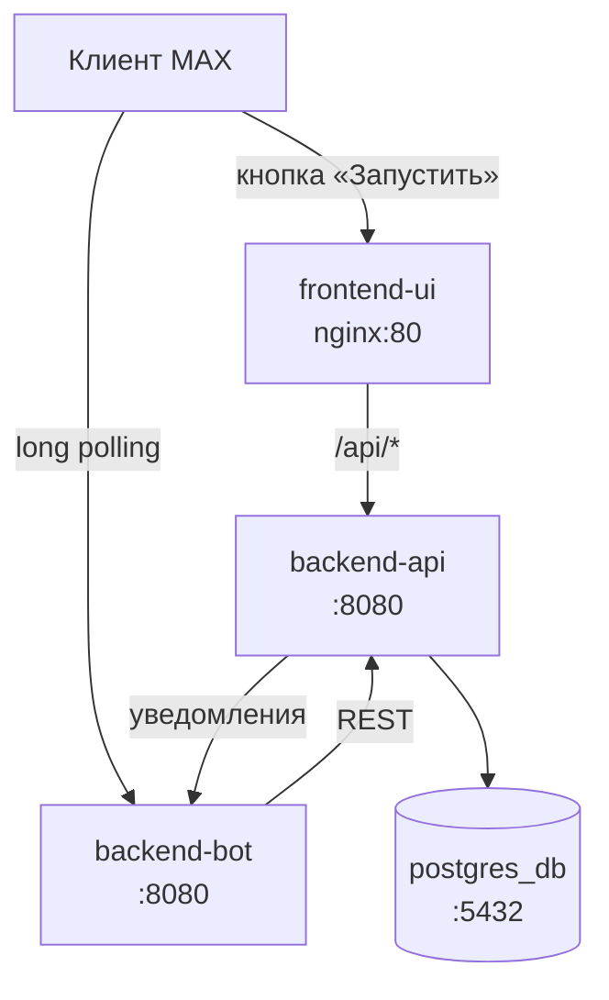

# АвтоУчёт (ATC)

Мини-приложение для самозанятых в мессенджере MAX: учёт доходов, формирование чеков, расчёт налога на профессиональный доход (НПД) и экспорт отчётности.


## 1. Назначение решения

**Задача.** Дать самозанятому инструмент, который упрощает рутинные налоговые операции: формирование чека на каждую операцию, расчёт налога по ставке, зависящей от типа покупателя, контроль срока уплаты и приближения к годовому лимиту дохода.

**Для кого.** Для плательщиков НПД - самозанятых, работающих как с физическими, так и с юридическими лицами. Решение не требует установки отдельного приложения: пользователь уже находится в мессенджере MAX, где получает ссылку на мини-приложение от бота.

**Какую проблему решает.**

- Чек нужно формировать на каждую операцию - при потоке заказов это откладывается.
- Ставка налога зависит от типа покупателя (4 % для физических лиц, 6 % для юридических лиц и ИП), и её путают.
- Срок уплаты - 28-е число - забывают.
- Годовой лимит дохода 2 400 000 ₽ сложно отслеживать вручную.

**Состав решения.** Четыре компонента: бот в MAX (онбординг, напоминания), статический веб-интерфейс мини-приложения, REST API с бизнес-логикой и база данных PostgreSQL. Всё разворачивается через Docker Compose.


## 2. Основной пользовательский сценарий

Ниже - путь от первого обращения к боту до сформированного отчёта.

| # | Действие пользователя | Компонент | Обработка | Результат |
||||||
| 1 | Отправляет боту `/start` | `backend-bot` | `MessageHandler` проверяет, принято ли соглашение | Бот присылает текст соглашения с кнопками «Принять» / «Отклонить» |
| 2 | Нажимает «Принять» | `backend-bot` → `backend-api` | `CallbackHandler` вызывает `POST /api/Users` | Аккаунт создан в БД, бот подтверждает согласие и показывает главное меню |
| 3 | Нажимает кнопку «Запустить» | MAX → `frontend-ui` | Открывается мини-приложение; `config.js` определяет `maxUserId` | Загружается лента доходов |
| 4 | Просматривает главный экран | `frontend-ui` → `backend-api` | `GET /api/Dashboard`, `GET /api/Receipts`, `GET /api/Users/profile` | Сумма к уплате за прошлый месяц, срок уплаты, доход за год, шкала лимита, история чеков |
| 5 | Открывает «Новый чек», заполняет сумму и тип покупателя | `frontend-ui` | `receipt.js` валидирует форму, `storage.js` маппит значения | Форма готова к отправке |
| 6a | Нажимает «Отправить ссылку на оплату» | `frontend-ui` → `backend-api` | `POST /api/Receipts/send-payment-link` - чек со статусом `WaitingPayment` | Переход на страницу ожидания оплаты, поллинг статуса каждые 4 секунды |
| 6b | Нажимает «Зафиксировать оплату» | `frontend-ui` → `backend-api` | `POST /api/Receipts/mark-as-paid` - чек со статусом `Paid` | Переход на страницу успешной оплаты |
| 7 | Клиент оплачивает по ссылке | платёжный шлюз → `backend-api` | `POST /api/Webhooks/robokassa` переводит чек в `Paid` | Статус чека обновлён, бот отправляет уведомление пользователю |
| 8 | Возвращается на ленту | `frontend-ui` | Повторная загрузка списка чеков | Чек отображается со статусом «Оплачено» |
| 9 | Получает напоминание о налоге | `backend-bot` | `TaxReminderBackgroundService` рассылает суммы к уплате | Сообщение с суммой и крайним сроком |
| 10 | Открывает «Экспорт отчёта» | `frontend-ui` → `backend-api` | `GET /api/Receipts/export?quarter=&year=` | Скачивается текстовый отчёт за квартал |

Чек на 24 часа переводится в статус `Expired` - статус не хранится в базе, а вычисляется на лету как `WaitingPayment` старше 24 часов (`ReceiptHelper.GetActualStatus`).


## 3. Состав и архитектура решения



### Компоненты

**`frontend-ui`** - статический веб-интерфейс мини-приложения. Технологии: HTML, CSS, JavaScript без шага сборки. Раздаётся через nginx, который также проксирует `/api/` на `backend-api`, благодаря чему фронтенд и API находятся на одном origin и CORS не требуется.

Структура клиентского кода:

| Файл | Назначение |
|||
| `config.js` | Определение `maxUserId` и базового URL API |
| `api.js` | Обёртка над `fetch` (методы `get`/`post`/`put`/`del`) |
| `storage.js` | Загрузка данных, маппинг полей API ↔ UI, форматирование |
| `<страница>.js` | Логика конкретного экрана |

Маппинг между контрактом API и моделью интерфейса сосредоточен в `storage.js` (функции `toReceipt` и `resolveStatus`), поэтому изменения контракта правятся в одном месте.

**`backend-api`** - REST API с бизнес-логикой. Технологии: ASP.NET Core 10, Entity Framework Core 10, Npgsql. При старте применяет миграции с повторными попытками подключения к базе (до 10 попыток с интервалом 3 секунды).

**`backend-bot`** - бот в мессенджере MAX. Технологии: ASP.NET Core 10, `SaaSoft.MAX.Bot` 1.2.2, `DotNetEnv`. Работает в режиме long polling, обрабатывает текстовые сообщения и нажатия inline-кнопок. Содержит фоновую службу напоминаний о налоге.

**`postgres_db`** - база данных PostgreSQL 16 (образ `postgres:16-alpine`).

### Потоки данных

1. **Онбординг.** MAX → бот → `POST /api/Users` → PostgreSQL.
2. **Чтение данных.** Браузер → nginx (`/api/`) → `backend-api` → PostgreSQL → ответ в UI.
3. **Создание чека.** Браузер → nginx → `backend-api` → PostgreSQL; далее API отправляет уведомление боту через `POST /api/Notification/payment-success`.
4. **Оплата.** Внешний платёжный шлюз → `POST /api/Webhooks/robokassa` → `backend-api` → PostgreSQL → уведомление боту.
5. **Напоминания.** `TaxReminderBackgroundService` (раз в 24 часа) → `GET /api/Users/tax-summary` → рассылка сообщений пользователям.

### Эндпоинты API

`backend-api`:

| Метод | Путь | Назначение |
||||
| `GET` | `/api/Users/tax-summary` | Суммы налога по пользователям за прошлый месяц |
| `GET` | `/api/Users/profile?maxUserId=` | Профиль: имя, виды деятельности, доход и число чеков за год |
| `GET` | `/api/Users/settings?maxUserId=` | Настройки пользователя |
| `PUT` | `/api/Users/settings?maxUserId=` | Изменение настроек |
| `POST` | `/api/Users` | Создание пользователя (идемпотентно) |
| `GET` | `/api/Users/activities?maxUserId=` | Список видов деятельности |
| `POST` | `/api/Users/activities?maxUserId=` | Добавление вида деятельности |
| `PUT` | `/api/Users/activities/{id}/default?maxUserId=` | Назначение основного вида деятельности |
| `DELETE` | `/api/Users/activities/{id}?maxUserId=` | Удаление вида деятельности |
| `GET` | `/api/Receipts?maxUserId=` | Список чеков пользователя |
| `GET` | `/api/Receipts/{id}?maxUserId=` | Чек по идентификатору |
| `GET` | `/api/Receipts/export?maxUserId=&quarter=&year=` | Чеки за квартал для отчёта |
| `POST` | `/api/Receipts/send-payment-link` | Создание чека со ссылкой на оплату (`Auto`) |
| `POST` | `/api/Receipts/mark-as-paid` | Создание чека с ручной фиксацией оплаты (`Manual`) |
| `DELETE` | `/api/Receipts/{id}?maxUserId=` | Удаление чека |
| `GET` | `/api/Dashboard?maxUserId=` | Сводка: налог за период, срок, доход за год, процент лимита |
| `POST` | `/api/Webhooks/robokassa` | Вебхук платёжного шлюза |

`backend-bot`:

| Метод | Путь | Назначение |
||||
| `POST` | `/api/Notification/payment-success` | Приём уведомления от API и отправка сообщения пользователю |
| `POST` | `/api/Notification/send-tax-reminders` | Ручной запуск рассылки напоминаний (параметр `forceSend`) |
| `GET` | `/api/data/status` | Проверка работоспособности бота |


## 4. Запуск через Docker

Все компоненты запускаются одной командой из корня репозитория:

```bash
docker compose up --build
```

Перед первым запуском создайте файл `.env` в корне репозитория на основе `.env.example` (см. раздел 6). Без него переменные `${POSTGRES_DB}`, `${POSTGRES_USER}`, `${POSTGRES_PASSWORD}`, `${BOT_MAX_TOKEN}` и `${MINI_APP_URL}` не подставятся, и конфигурация будет неполной.

Порядок запуска задаётся директивами `depends_on`: `postgres_db` → `backend-api` → `backend-bot`. Сервис `frontend-ui` также зависит от `backend-api`. Ожидание готовности базы реализовано в самом API - он повторяет попытки подключения, поэтому отдельный healthcheck не требуется.

Для запуска в фоне:

```bash
docker compose up -d --build
```


## 5. Параметры окружения

**Требования к системе.**

- Операционная система: Windows, macOS или Linux с установленным Docker.
- Docker Engine с поддержкой Docker Compose v2 (`docker compose`).
- Для сборки образов используется .NET SDK 10 и nginx внутри контейнеров - установка .NET или Node.js на хост не требуется.

**Свободные порты.** 80 (фронтенд), 5000 (API), 5432 (PostgreSQL). Все три должны быть свободны на хосте.

**Внешние условия.**

- Токен бота MAX - обязателен для запуска `backend-bot`. Без него приложение завершится с ошибкой `API токен не найден`.
- Доступ к сети Интернет - для работы бота (long polling до MAX) и первичной загрузки образов.


## 6. Переменные окружения

Файл `.env` в корне репозитория. Шаблон - `.env.example`.

| Переменная | Обязательность | Назначение | Пример |
|||||
| `POSTGRES_DB` | Обязательна | Имя базы данных | `autouchet-bd` |
| `POSTGRES_USER` | Обязательна | Пользователь PostgreSQL | `admin` |
| `POSTGRES_PASSWORD` | Обязательна | Пароль PostgreSQL | `change-me` |
| `BOT_MAX_TOKEN` | Обязательна | Токен бота MAX | `your-bot-token` |
| `MINI_APP_URL` | Обязательна | URL, который бот открывает кнопкой «Запустить» | `http://192.168.1.10` |

Переменные, задаваемые в `docker-compose.yml` и не требующие ручного заполнения:

| Переменная | Сервис | Значение |
||||
| `ASPNETCORE_ENVIRONMENT` | `backend-api`, `backend-bot` | `Production` |
| `ConnectionStrings__DefaultConnection` | `backend-api` | Строка подключения к `postgres_db`, собирается из переменных `POSTGRES_*` |
| `BotSettings__NotificationUrl` | `backend-api` | `http://backend-bot:8080` |
| `BotSettings__MaxToken` | `backend-bot` | Значение `${BOT_MAX_TOKEN}` |
| `BotSettings__MiniAppUrl` | `backend-bot` | Значение `${MINI_APP_URL}` |
| `BackendApi__BaseUrl` | `backend-bot` | `http://backend-api:8080` |

Переменные, читаемые ботом напрямую из окружения (`Program.cs`): `API_KEY_MAX` (альтернатива `BotSettings__MaxToken`), `MINI_APP_URL`, `BackendApi__BaseUrl`. Дополнительно `BackendApiClient` читает переменную `API_URL` - если она не задана, используется `http://localhost:5000` (см. раздел 14).

Не добавляйте в репозиторий реальные токены и пароли. Файл `.env` исключён через `.gitignore`.


## 7. Используемые порты

| Компонент | Внутренний порт | Порт на хосте | Назначение |
||:|:||
| `frontend-ui` (nginx) | 80 | 80 | Веб-интерфейс и прокси `/api/` |
| `backend-api` | 8080 | 5000 | REST API |
| `backend-bot` | 8080 | - | HTTP-эндпоинты уведомлений, доступны только внутри сети Compose |
| `postgres_db` | 5432 | 5432 | PostgreSQL |

Браузер обращается к API через nginx по пути `/api/`, поэтому обращаться к `http://localhost:5000` из интерфейса не требуется.


## 8. Зависимости

**Runtime и образы Docker.**

| Компонент | Источник |
|||
| `backend-api` | `mcr.microsoft.com/dotnet/sdk:10.0` (сборка), `mcr.microsoft.com/dotnet/aspnet:10.0` (запуск) |
| `backend-bot` | `mcr.microsoft.com/dotnet/sdk:10.0` (сборка), `mcr.microsoft.com/dotnet/aspnet:10.0` (запуск) |
| `frontend-ui` | `nginx:alpine` |
| `postgres_db` | `postgres:16-alpine` |

**`backend-api` (AutoUchet.Api.csproj).**

| Пакет | Версия | Назначение |
||||
| `Microsoft.AspNetCore.OpenApi` | 10.0.9 | Поддержка OpenAPI |
| `Microsoft.EntityFrameworkCore.Design` | 10.0.0 | Инструменты миграций EF Core |
| `Microsoft.EntityFrameworkCore.Tools` | 10.0.0 | Команды EF Core для CLI |
| `Npgsql.EntityFrameworkCore.PostgreSQL` | 10.0.0 | Провайдер PostgreSQL для EF Core |
| `Swashbuckle.AspNetCore` | 10.0.0 | Swagger UI |

**`backend-bot` (bot.csproj).**

| Пакет | Версия | Назначение |
||||
| `SaaSoft.MAX.Bot` | 1.2.2 | SDK для ботов MAX |
| `DotNetEnv` | 3.2.0 | Загрузка переменных из файла `.env` |
| `Swashbuckle.AspNetCore` | 10.2.3 | Swagger UI |

**Frontend.** Внешних библиотек нет - только стандартные HTML, CSS и JavaScript. Шрифты SF Pro Display поставляются в репозитории (`frontend-ui/src/assets/fonts/`).

**База данных.** PostgreSQL 16. Миграции EF Core применяются автоматически при старте `backend-api`:

1. `20260918175835_InitialCreate`
2. `20260922150350_UpdateEntitiesForIntegration`
3. `20260925121049_AddActivitiesTable`
4. `20260925123252_RenameActivityTable`


## 9. Внешние сервисы и интеграции

**MAX (мессенджер).** Платформа, в которой работает бот и открывается мини-приложение. Взаимодействие: long polling через SDK `SaaSoft.MAX.Bot`. Требуется токен бота (`BOT_MAX_TOKEN`). Для локального запуска обязателен - без токена `backend-bot` не стартует.

**Robokassa (платёжный шлюз).** Приём оплаты по ссылке.

- Взаимодействие: `backend-api` формирует ссылку вида `https://robokassa.fake/pay?inv=<GUID>` и принимает вебхук `POST /api/Webhooks/robokassa`.
- Текущее состояние: **заглушка**. Используется фиктивный домен, реальные платежи не проводятся. Вебхук принимает поля `OutSum` и `InvoiceId`, но не проверяет подпись.
- Для локального запуска не требуется.

**ФНС / «Мой налог» (сервис формирования чеков).** Регистрация чека в налоговой.

- Взаимодействие: `backend-api` генерирует ссылку на чек через `GeneratorMockUrl.CreateMockFnsUrl()`.
- Текущее состояние: **заглушка**. Возвращается адрес вида `https://mock-fns.local/receipt/<GUID>`, реальная регистрация чеков не производится.
- Для локального запуска не требуется.


## 10. Работа с данными

**Хранилище.** PostgreSQL 16, том Docker `postgres_data`, примонтированный в `/var/lib/postgresql/data`. Данные сохраняются между перезапусками контейнеров и удаляются только при явном удалении тома.

**Сущности.**

*`Users`* - аккаунт пользователя.

| Поле | Тип | Описание |
||||
| `Id` | `int` | Первичный ключ |
| `MaxUserId` | `long` | Идентификатор пользователя в MAX |
| `FirstName` | `string` | Имя |
| `RemindAboutTax` | `bool` | Признак подписки на напоминания (по умолчанию `true`) |
| `TaxRate` | `decimal` | Поле присутствует в схеме, но не используется в расчётах |

*`Receipts`* - чек.

| Поле | Тип | Описание |
||||
| `Id` | `int` | Первичный ключ |
| `UserId` | `int` | Ссылка на пользователя |
| `Amount` | `decimal` | Сумма |
| `BuyerType` | `string` | Тип покупателя: `Физ` или `Юр` |
| `PurposeOfPayment` | `string` | Назначение - название вида деятельности |
| `Status` | `string` | `WaitingPayment` или `Paid` |
| `PaymentType` | `string` | `Auto` или `Manual` |
| `RobokassaInvoiceId` | `string?` | Идентификатор счёта в платёжном шлюзе |
| `MockFnsUrl` | `string?` | Ссылка на чек ФНС |
| `PaidAt` | `DateTime?` | Дата оплаты |
| `CreatedAt` | `DateTime` | Дата создания |

*`Activities`* - вид деятельности.

| Поле | Тип | Описание |
||||
| `Id` | `int` | Первичный ключ |
| `UserId` | `int` | Ссылка на пользователя |
| `Name` | `string` | Название |
| `IsDefault` | `bool` | Признак основного вида деятельности |

**Как данные поступают в систему.**

- Идентификатор пользователя - от MAX, через параметр `?maxUserId=` в ссылке на мини-приложение.
- Данные чека (сумма, тип покупателя, вид деятельности, дата оплаты) - из формы в интерфейсе.
- Факт оплаты - из вебхука платёжного шлюза.
- Настройки (подписка на напоминания) - из интерфейса.

**Как обрабатываются.**

- Все запросы к данным выполняет `backend-api` через Entity Framework Core. Прямого доступа к базе из интерфейса или бота нет.
- Ставка налога определяется по типу покупателя в момент запроса: `Физ` → 4 %, иначе → 6 %.
- Статус `Expired` не хранится: он вычисляется как `WaitingPayment` старше 24 часов.
- Процент использования годового лимита рассчитывается как отношение дохода за год к 2 400 000 ₽.

**Доступ к данным.** Выборка чеков и видов деятельности ограничена пользователем: запросы фильтруются по `UserId`, полученному из `maxUserId`. Аутентификации при этом нет (см. раздел 14), поэтому значение `maxUserId` не является защищённым идентификатором.

**Сохранение между перезапусками.** Данные в PostgreSQL сохраняются при остановке и перезапуске контейнеров за счёт тома `postgres_data`. Данные в браузере (идентификатор пользователя в `localStorage` под ключом `atc_max_user_id`) сохраняются в рамках origin. Состояние бота - принятие пользовательского соглашения - хранится в памяти процесса (`HashSet`) и **теряется при перезапуске** `backend-bot`.


## 11. Работа с тестовыми данными

В проекте нет сидов, fixtures или предустановленных тестовых аккаунтов. Данные создаются в ходе работы с системой.

**Порядок подготовки.**

1. Создайте `.env` и запустите решение (раздел 4). При старте `backend-api` создаст таблицы через миграции.
2. Создайте пользователя. Проще всего - через API, без обращения к боту:

```bash
curl -X POST http://localhost/api/Users \
  -H "Content-Type: application/json" \
  -d "{\"maxUserId\":123456789,\"firstName\":\"Test\"}"
```

Ответ: `201 Created` с телом `{"id":1,"maxUserId":123456789,"firstName":"Test"}`. При повторном вызове с тем же `maxUserId` вернётся `200 OK` с существующим пользователем.

3. Добавьте вид деятельности - без него создание чека заблокировано валидацией формы:

```bash
curl -X POST "http://localhost/api/Users/activities?maxUserId=123456789" \
  -H "Content-Type: application/json" \
  -d "{\"name\":\"Ремонт квартир\"}"
```

Первый добавленный вид деятельности автоматически становится основным (`isDefault: true`).

**Проверка созданных данных.**

```bash
curl "http://localhost/api/Users/profile?maxUserId=123456789"
```

**Очистка.** Удалите пользователя вместе с его данными, пересоздав том базы (раздел 15, полный сброс), - отдельных эндпоинтов удаления пользователя в API нет. Для удаления отдельных чеков и видов деятельности эндпоинты есть и доступны из интерфейса.

**Обратите внимание:** идентификатор `123456789` - произвольное число. Любое значение `maxUserId`, для которого в базе есть запись, будет принято системой (см. раздел 14).


## 12. Пошаговый сценарий проверки

Проверка охватывает полный путь: API → интерфейс → бот.

### Шаг 1. Запуск

```bash
docker compose up --build
```

Ожидаемые сообщения в логах:

- `autouchet_api` - `[DB Migration] Попытка подключения к БД #1...` и затем `[DB Migration] Успешно! Миграции применены.`
- `autouchet_bot` - `Бот запущен: <имя> (ID: <id>)`

### Шаг 2. Проверка готовности эндпоинтов

```bash
curl -i http://localhost/api/data/status
```

Ожидается `404` - этот эндпоинт принадлежит боту, а не API, и через прокси nginx недоступен. Проверьте бот напрямую:

```bash
docker compose exec backend-bot curl -s http://localhost:8080/api/data/status
```

Ожидается `{"status":"Active","serverTime":"..."}`.

### Шаг 3. Создание тестовых данных

Выполните команды из раздела 11. После них:

```bash
curl "http://localhost/api/Users/profile?maxUserId=123456789"
```

Ожидается ответ вида:

```json
{
  "firstName": "Test",
  "maxUserId": 123456789,
  "activities": [{"id":1,"name":"Ремонт квартир","isDefault":true}],
  "receiptCountYear": 0,
  "totalIncomeYear": 0
}
```

### Шаг 4. Проверка интерфейса

Откройте в браузере:

```
http://localhost/pages/home.html?maxUserId=123456789
```

Ожидаемый результат:

- Главный экран «Лента доходов» без ошибок в консоли.
- Блок «К уплате за <прошлый месяц>» с суммой `0 ₽`.
- Доход за год `0 ₽`, шкала лимита `0.0%`.
- История чеков пуста, отображается заглушка «Здесь пока нет чеков».

Если вместо этого показано сообщение «Вы не авторизовались. Откройте приложение по ссылке из бота» - параметр `maxUserId` не дошёл до страницы. Проверьте, что он присутствует в адресной строке.

### Шаг 5. Создание чека вручную

1. Нажмите «Новый чек» в нижней части главного экрана.
2. Выберите «Физическое лицо», введите сумму `1000`.
3. В поле «Вид деятельности» выберите «Ремонт квартир».
4. Нажмите «Зафиксировать оплату».

Ожидаемый результат: переход на страницу «Чек оплачен» с суммой `1 000 ₽`.

Проверка через API:

```bash
curl "http://localhost/api/Receipts?maxUserId=123456789"
```

Ожидается массив с одним чеком, где `status` равен `Paid`, `paymentType` - `Manual`, `taxRate` - `0.04`.

### Шаг 6. Проверка расчёта налога

```bash
curl "http://localhost/api/Dashboard?maxUserId=123456789"
```

При сумме 1000 ₽ по ставке 4 % ожидается `taxAmount: 40` (при условии, что дата оплаты попадает в расчётный период; см. раздел 13).

Вернитесь на главный экран и обновите страницу - в блоке «К уплате» отобразится рассчитанная сумма.

### Шаг 7. Проверка чека со ссылкой на оплату

1. Создайте новый чек: «Новый чек» → «Физическое лицо» → сумма `500` → вид деятельности → «Отправить ссылку на оплату».
2. Ожидается переход на страницу «Платеж в обработке».
3. Скопируйте ссылку кнопкой «Скопировать ссылку еще раз» - в буфере окажется адрес вида `https://robokassa.fake/pay?inv=<GUID>`.

Чек получит статус `WaitingPayment`. Страница опрашивает статус каждые 4 секунды; по истечении 24 часов чек перейдёт в `Expired`.

### Шаг 8. Проверка экспорта

1. Откройте меню (иконка в правом верхнем углу) → «Экспорт отчета».
2. Выберите квартал и нажмите «Сформировать».

Ожидается загрузка файла `otchet-q<N>-<год>.txt` со списком чеков и итогами по доходу и налогу.

### Шаг 9. Проверка бота

1. Отправьте боту `/start`. При первом обращении - соглашение с кнопками «Принять» и «Отклонить».
2. Нажмите «Принять». Ожидается сообщение о принятии согласия и главное меню.
3. Нажмите «Запустить». Ожидается открытие мини-приложения.

Проверка, что бот создал пользователя:

```bash
curl "http://localhost/api/Users/profile?maxUserId=<ваш id из MAX>"
```


## 13. Примеры ожидаемого поведения

**Создание пользователя повторно.** Запрос `POST /api/Users` с уже существующим `maxUserId` не создаёт дубликат и возвращает `200 OK` с данными существующей записи. Первый вызов возвращает `201 Created`.

**Неизвестный пользователь.** `GET /api/Users/profile?maxUserId=<нет в базе>` возвращает `404 Not Found`. Обёртка `api.js` трактует `404` как `null`, поэтому интерфейс показывает состояние ошибки загрузки, а не сбой.

**Ставка налога по типу покупателя.**

| Вход | Результат |
|||
| Сумма 1000, тип `individual` (отправляется как `Физ`) | `taxRate: 0.04`, налог 40 ₽ |
| Сумма 1000, тип `legal` (отправляется как `Юр`) | `taxRate: 0.06`, налог 60 ₽ |

**Чек без вида деятельности.** Эндпоинт создания не выполняет поиск активности, если передан `activityId`, которому не соответствует запись; в этом случае в поле `purposeOfPayment` сохраняется значение `Без назначения`. Интерфейс предотвращает эту ситуацию на шаге валидации формы, требуя выбрать вид деятельности.

**Ссылка на оплату заблокирована для юридических лиц.** При выборе типа «Юридическое лицо» кнопка «Отправить ссылку на оплату» становится неактивной и отображается подсказка о необходимости зафиксировать оплату вручную. Это ограничение заложено в интерфейсе: автосвязка с платёжным шлюзом предусмотрена только для физических лиц.

**Расхождение периодов в разных эндпоинтах.** `GET /api/Dashboard` и `GET /api/Users/tax-summary` определяют расчётный месяц независимо друг от друга, и их логика различается (см. раздел 14). В зависимости от текущей даты они могут вернуть суммы за разные месяцы.

**Просроченный чек.** Чек со статусом `WaitingPayment`, созданный более 24 часов назад, возвращается в API со статусом `Expired` и `paymentUrl: null`. В интерфейсе отображается как «Не оплачено», кнопка копирования ссылки скрыта.


## 14. Известные ограничения

**Аутентификация и разграничение доступа.** В системе нет аутентификации. Пользователь идентифицируется числовым параметром `maxUserId`, который передаётся в открытом виде и может быть подставлен произвольно. Любой запрос с известным `maxUserId` вернёт данные соответствующего пользователя. Это осознанное упрощение для прототипа; для эксплуатации требуется проверка подписи `initData` от MAX на стороне API.

**Платёжные операции и регистрация чеков - заглушки.** Реальные платежи не проводятся, чеки в налоговой не регистрируются. Используются фиктивные домены `robokassa.fake` и `mock-fns.local`. Вебхук платёжного шлюза не проверяет подпись и не сверяет `OutSum` с суммой чека, поэтому не может служить подтверждением фактической оплаты.

**Интеграция с MAX SDK в интерфейсе не завершена.** Функции `getInitDataUser()` и `getInitData()` в `config.js` предполагают получение идентификатора пользователя через нативный объект мини-приложения (`window.MAX`/`window.Max`/`window.WebApp`). Скрипт MAX SDK в разметке страниц не подключён, а формат `initData` не подтверждён по документации. Фактически идентификатор поступает только через параметр `?maxUserId=` либо из `localStorage`.

**Идентификатор пользователя не сохраняется при переходах между страницами.** Если страница открыта без параметра `?maxUserId=` и в `localStorage` для текущего origin запись отсутствует, интерфейс показывает ошибку «Вы не авторизовались». Значение `localStorage` привязано к origin, поэтому `localhost` и `127.0.0.1` используют независимые хранилища.

**Состояние принятия соглашения хранится в памяти.** `UserService` использует статический `HashSet<long>`, который очищается при перезапуске `backend-bot`. После перезапуска все пользователи повторно получают запрос на принятие соглашения. Данные в PostgreSQL при этом сохраняются.

**Двойной источник конфигурации адреса API в боте.** `Program.cs` задаёт `BaseAddress` для `BackendApiClient` из переменной `BackendApi__BaseUrl` (`http://backend-api:8080` в Compose), однако конструктор `BackendApiClient` перезаписывает его значением переменной `API_URL`, по умолчанию `http://localhost:5000`. Переменная `API_URL` в `docker-compose.yml` не задана, поэтому в контейнерной среде итоговый адрес определяется поведением конструктора и может не указывать на `backend-api`.

**Напоминания о налоге отправляются ежедневно.** `TaxReminderBackgroundService` выполняет рассылку при каждом проходе цикла в период с 25-го числа по срок уплаты, то есть несколько раз в месяц, а не за 5 и за 1 день. Функция `TaxDeadlineChecker.CheckNotificationTrigger`, реализующая проверку «осталось 5 или 1 день», используется только в эндпоинте ручного запуска `POST /api/Notification/send-tax-reminders`.

**Расчёт налогового периода выполняется в трёх местах независимо.**

| Компонент | Логика |
|||
| `DashboardController` | Предыдущий месяц; если текущий день больше дня срока - текущий месяц |
| `UsersController.GetUsersTaxSummary` | Предыдущий месяц, без смещения |
| `TaxDeadlineChecker` (бот) | Период с 25-го числа по срок уплаты |

Из-за различий суммы, показанные пользователю и отправленные в уведомлении, могут относиться к разным месяцам.

**Поле `User.TaxRate` не используется.** Присутствует в сущности и схеме базы, но не участвует в расчётах: ставка определяется по типу покупателя в каждом запросе.

**Дата оплаты в форме чека учитывается не во всех режимах.** Поле «Дата оплаты» передаётся в API только при создании чека с ручной фиксацией (`mark-as-paid`). В режиме «Отправить ссылку на оплату» значение поля не отправляется, и дата оплаты проставляется сервером в момент подтверждения платежа.

**Формат экспорта.** Отчёт формируется на клиенте как текстовый файл (`.txt`) с полями, разделёнными пробелами. Файл не является машиночитаемым и не предназначен для подачи в налоговый орган; в самом файле указано, что он носит справочный характер.

**Секреты в конфигурации.** Пароль PostgreSQL присутствует в `backend-api/AutoUchet.Api/appsettings.json` в виде значения строки подключения по умолчанию (`localhost`). В контейнерной среде строка подключения переопределяется через переменные окружения, однако значение из файла остаётся в репозитории. Порт PostgreSQL (5432) проброшен на хост.

**Отсутствие тестов.** Автоматические тесты в репозитории отсутствуют.


## 15. Остановка и повторный запуск

**Остановка.** Останавливает и удаляет контейнеры, сохраняя том с данными:

```bash
docker compose down
```

**Остановка с удалением данных.** Дополнительно удаляет том `postgres_data`; все данные базы будут потеряны:

```bash
docker compose down -v
```

**Перезапуск.** Возвращает остановленные контейнеры в рабочее состояние:

```bash
docker compose start
```

Либо, если контейнеры были удалены командой `down`, но том сохранён:

```bash
docker compose up
```

**Когда требуется `--build`.**

- После изменения исходного кода `backend-api`, `backend-bot` или статических файлов `frontend-ui`.
- После изменения любого `Dockerfile`.
- После изменения `nginx.conf`.

```bash
docker compose up --build
```

Изменения в файлах `.env` пересборки не требуют - достаточно перезапуска:

```bash
docker compose up -d --force-recreate
```

**Когда требуется очистка томов.**

- Для сброса базы в исходное состояние (например, чтобы заново применить миграции с нуля).
- После ручного изменения схемы данных.
- При смене значения `POSTGRES_PASSWORD` - пароль задаётся только при инициализации тома, и для существующего тома новое значение не применится.

Полное пересоздание окружения:

```bash
docker compose down -v
docker compose up --build
```

**Просмотр состояния и логов.**

```bash
docker compose ps
docker compose logs -f backend-api
```
